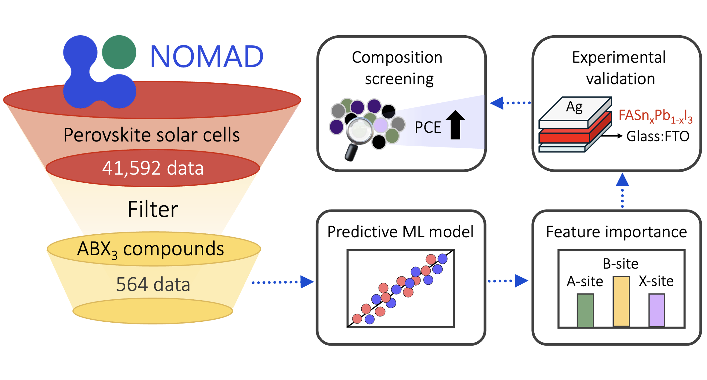

# ML for Properties in Halide Perovskites
This repository contains the data and codes used in our study of five photovoltaic properties in halide-based perovskites using machine learning.

The dataset used in this study is provided in the "Initial data" folder.

The Pearson correlation coefficients between the compositional input features and the target photovoltaic properties are provided in the "Pearson correlation" folder.

The machine learning codes used to train and evaluate the regression models are provided in the "Regression model" folder. This folder includes the dataset and codes for: 
Extra Trees Regression (ETR), Gradient Boosting Regression Trees (GBRT), Kernel Ridge Regression (KRR), Random Forest Regression (RFR), and Extreme Gradient Boosting (XGB)

The codes used to calculate and plot the mean absolute SHAP values for compositional feature importance are provided in the "SHAP" folder.

The codes and prediction results used for out-of-sample analysis and composition screening are provided in the "Out-of-sample analysis" folder.

## License
This code is made available under the MIT License.

## Requirements
The machine learning training and prediction codes are compatible with Python 3. The following open-source Python packages are required:
* numpy
* matplotlib
* pandas
* xgboost
* shap

## Contact
Chadawan Khamdang, SUNY Binghamton (ckhamdang@binghamton.edu)
